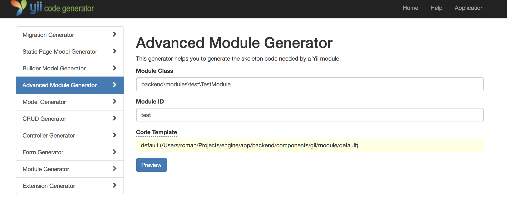

### Advanced Module Generator



Генерация модуля в бекенд-приложение. Аналог дефолтного yii-шного генератора, но с видоизмененной структурой директорий.

После генерации модуля необходимо подключить его в конфигурацию бекенда `backend/config/main.php`:

```php
......
'modules' => [
    'test' => backend\modules\test\TestModule::class,
],
......
```

Для удобства подключения, автодополнения в IDE, визуального понимания - рекомендую называть модуль как в примере выше: `TestModule`, `PressCentreModule` и тд.
