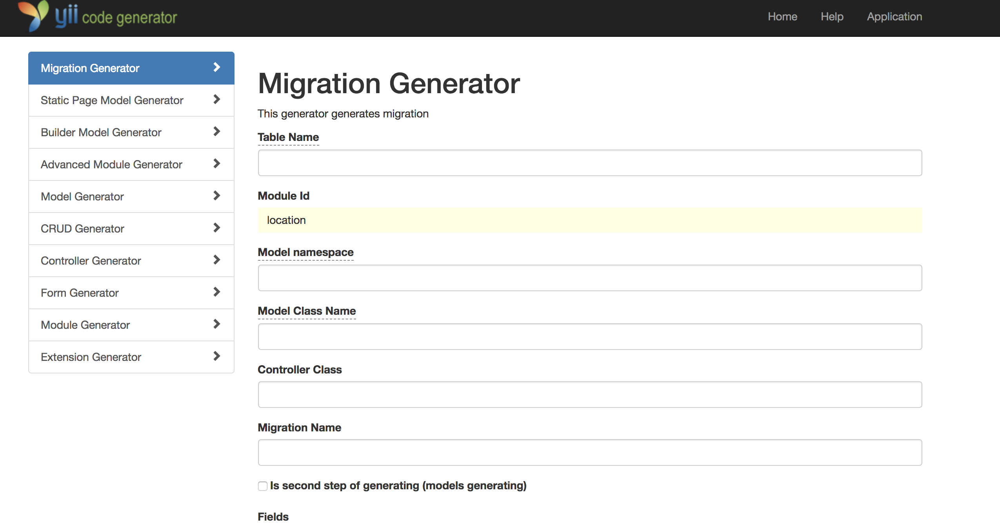

Генератор миграций, crud и common моделей
===================================

Позволяет создавать файлы миграций, поднимать миграции, генерировать crud и common модели, т.е. теперь не надо использовать
консоль для создания миграции и поднятия ее. Также поддерживается мультиязычность.

##Особенности использования

Поскольку все модели для backend мы храним в модулях, сперва нужно создать модуль через [Advanced Module Generator](AdvancedModuleGenerator.md).
Далее перейти в раздел `Migration Generator` и заполнить поля:

`Table Name` - название будущей таблицы.

`Module Id` - id модуля, где будут созданны модели и контроллер. Поле необходимо для автозаполнения полей `Model namespace`
и `Controller Class`.

`Model namespace` - namespace модели для backend;

`Model Class Name` - название генерируемой модели для backend и common;

`Controller Class` - полное имя контроллера для backend;

`Migration Name` - название класса миграции;

`Is second step of generating (models generating)` - шаг генерации.

Генерация проиходит в два шага.

На первом - генерируется и поднимается миграция.

На втором - генерируются все необходимые модели и контроллер. После выполнения первого шага, для
продолжения необходимо нажать на кнопку Preview, после чего будет предложено сгенерировать модели и контроллер. 
ВАЖНО! В случае, когда таблица в базе уже создана и генератор настроен на первый шаг (генерацию миграции), данная таблица
будет удалена и затем пересоздана с текущими настройками.

`Fields` - здесь задается структура будущей таблицы. Type params - параметры типа поля (например, при integer(11), нужно
указать в этом поле 11. Если параметров два, указывать их через запятую). Lang - поставить галочку, если это поле мультиязычное.
Index - если поставить галочку, будет создан индекс для данного поля. Есть возможность сортировки полей.

`Foreign Keys` - здесь задаются внешние ключи. Название внешнего ключа генерируется автоматически исходя из заполненных полей.

Кроме этого, есть возоможность сконфигурировать необходимое количество виджетов загрузки файлов (изображений), подключить ajax-валидацию, SEO behavior.

Добавлена галочка `Generate Labels from DB Comments`, для возможности генерировать `attributeLabels` из комментариев в таблице

Конфигурацию отображения `index`, `view` можно отредактировать в модели в методе
`getColumns()`

Конфигурация формы `create/update` - в методе `getFormConfig()`
